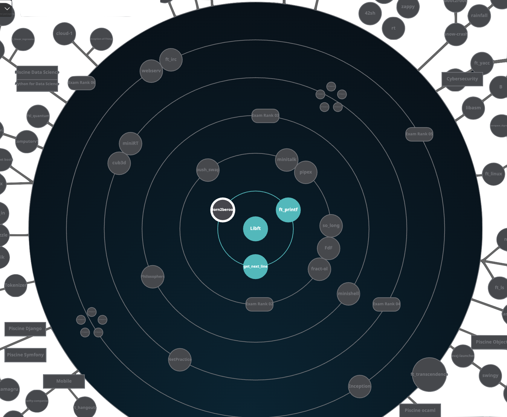

# Projet Tronc Commun - Portfolio

)

> Dépôt contenant mes projets du tronc commun (42). Ce README liste l'état d'avancement des projets

---

## 🧾 Statut global

| Projet | Statut | Notes |
|---|---:|---|
| `libft` | ✅ **Terminé** | 125% |
| `ft_printf` | ✅ **Terminé** | 100% |
| `get_next_line` | ✅ **Terminé** | 100% |
| `so_long` | ✅ **Terminé** | Manque les bonus |
| `push_swap` | ✅ **Terminé** | Manque les bonus |
| Autres projets du tronc commun | ❌ *À compléter* | |

---

## 🎯 Objectifs / Règles du rendu (rappel)

---

## 📸

